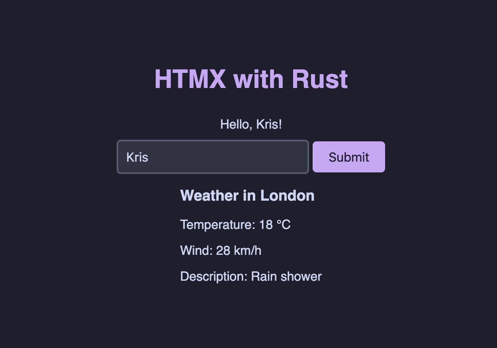

# HTMX-Rust

Simple `HTMX` server written in `Rust` using `Axum`. Showcasing usage of `form` to get react-like behavior.



## Usage

To run the server, execute the following command in the terminal:

```bash
cargo run
```
